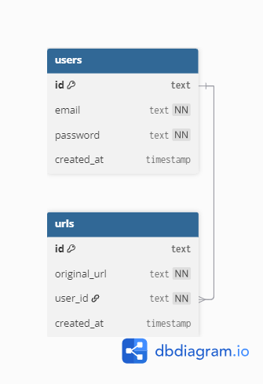

# Software Requirements Specification (SRS)

# LinkFlow – Multi-Tenant URL Shortening Service

## Preface

This document provides the Software Requirements Specification (SRS) for the LinkFlow system. It defines the functionalities, architecture, security requirements, and operational constraints necessary for the development and deployment of the system.

---

## Version History

* **Version 1.0** – Initial Draft.

---

# 1. Introduction

## Purpose

LinkFlow is a backend-focused multi-tenant URL shortening service designed to allow users to create, manage, retrieve, and securely access shortened URLs. The system focuses on backend engineering concepts including authentication, authorization, caching, middleware architecture, database persistence, and scalable API development.

The system enables authenticated users to generate short URLs while ensuring ownership isolation, secure access control, and efficient redirection through Redis caching.

---

## Document Conventions

This document follows the IEEE SRS standard using:

* **Must** – Indicates mandatory requirements.
* **Should** – Indicates recommended features.
* **May** – Indicates optional future enhancements.

---

## Intended Audience and Reading Suggestions

* **Backend Developers** – For implementation guidance.
* **Project Evaluators & Instructors** – To understand project architecture and scope.
* **Testers & QA Teams** – To validate compliance with requirements.
* **System Designers** – To understand backend architecture and scalability.

---

## Scope

The system provides:

* User registration and login
* JWT-based authentication
* URL shortening and redirection
* User-specific URL management
* Redis-based caching
* PostgreSQL persistence
* Middleware-based request processing
* Rate limiting and request logging
* Dockerized deployment support

---

## References

* IEEE Standard 830-1998 (Software Requirements Specification)
* Go Language Documentation
* PostgreSQL Documentation
* Redis Documentation
* Docker Documentation
* JWT Authentication Documentation

---

# 2. Overall Description

## Product Perspective

LinkFlow is a standalone backend web service built using Go. The system follows layered architecture and interacts with PostgreSQL and Redis for persistence and caching.

The application is containerized using Docker and exposes REST APIs for client communication.

---

## Product Functions

* **User Authentication:** Register and log in users securely using JWT.
* **URL Shortening:** Generate short URLs from long URLs.
* **URL Redirection:** Redirect users to original URLs using short identifiers.
* **User URL Management:** Retrieve and delete user-owned URLs.
* **Caching:** Improve redirect performance using Redis.
* **Middleware Processing:** Logging, request tracing, rate limiting, and authentication.
* **Docker Deployment:** Portable deployment environment.

---

## User Classes and Characteristics

* **Guest User:** Can access redirected public URLs.
* **Registered User:** Can create, manage, and delete personal URLs.

---

## Operating Environment

* Linux / Windows supported
* Docker-based deployment
* REST API communication
* **Database:** PostgreSQL
* **Cache:** Redis

---

## Design and Implementation Constraints

* The system must use Go as the backend language.
* JWT must be used for authentication.
* PostgreSQL must be used for persistent storage.
* Redis must be used for caching.
* APIs must return JSON responses.
* Docker must be supported for deployment.

---

## Assumptions and Dependencies

* Internet access is required.
* Docker must be installed in deployment environment.
* Redis and PostgreSQL services must be available.
* JWT secret keys must be configured securely.

---

# 3. System Requirements Specification

## Functional Requirements

### User Authentication

* The system must allow users to register and log in.
* The system must generate JWT tokens after successful login.
* The system must validate JWT tokens for protected routes.
* The system must reject invalid or expired tokens.

---

### URL Shortening

* Authenticated users must be able to shorten URLs.
* The system must validate URL format before storage.
* The system must generate unique short identifiers.
* URLs must be associated with specific users.

---

### URL Redirection

* The system must redirect users using shortened URLs.
* The system must check Redis cache before querying database.
* The system must cache resolved URLs for faster future access.

---

### User URL Management

* Users must be able to retrieve all their URLs.
* Users must be able to delete their own URLs.
* Users must not be able to delete URLs owned by others.

---

### Middleware Processing

* The system must log incoming requests.
* The system must assign request IDs.
* The system must enforce rate limiting.
* The system must process authentication middleware for protected routes.

---

## Non-Functional Requirements

### Performance Requirements

* URL redirection should be fast and optimized using Redis.
* The system should support concurrent users.
* Database queries should be minimized through caching.

---

### Security Requirements

* JWT-based authentication must be implemented.
* User ownership validation must be enforced.
* Sensitive data must be protected.
* Unauthorized API access must be blocked.

---

### Reliability and Availability

* The system should handle invalid requests safely.
* Middleware should prevent server crashes caused by malformed requests.
* Persistent data storage must be ensured.

---

### Maintainability and Support

* The project must follow layered architecture.
* The system should support modular code updates.
* Handlers, services, and storage layers must remain separated.

---

### Portability

* The system should support Docker deployment.
* The system should run on Linux and Windows environments.

---

# 4. System Models

> * **HIGH-LEVEL ARCHITECTURE DIAGRAM**

<!--
Insert High-Level Architecture Diagram Here

Suggested Components:
Client
↓
HTTP Router
↓
Middleware Layer
↓
Handler Layer
↓
Service Layer
↓
Storage Layer
↓
PostgreSQL

Redis connected to service layer for caching.
-->

---

> * **REQUEST FLOW DIAGRAM**

<!--
Insert Request Flow Diagram Here

Suggested Flow:
Client Request
↓
RequestID Middleware
↓
Logger Middleware
↓
Rate Limiter
↓
Authentication Middleware
↓
Handler
↓
Service
↓
Database / Redis
-->

---

> * **AUTHENTICATION FLOW DIAGRAM**

<!--
Insert Authentication Flow Diagram Here

Suggested Flow:
User Login
↓
Credential Validation
↓
JWT Token Generation
↓
Client Stores Token
↓
Authenticated Request
↓
Middleware Validates Token
↓
Request Authorized
-->

---

> * **URL REDIRECTION FLOW DIAGRAM**

<!--
Insert URL Redirection Flow Diagram Here

Suggested Flow:
User Requests Short URL
↓
Redis Cache Lookup
↓
Cache Hit → Redirect
↓
Cache Miss → PostgreSQL Query
↓
Store in Redis
↓
Redirect User
-->

---

> * **ENTITY RELATIONSHIP DIAGRAM**



---

> * **SEQUENCE DIAGRAM**

<!--
Insert Sequence Diagram Here

Suggested Flow:
Client → Router → Middleware → Handler → Service → Redis/PostgreSQL → Response
-->

---

# 5. System Evolution

## Assumptions

* The system may support analytics features in future.
* Frontend dashboard integration may be added later.
* Cloud deployment support may be expanded.

---

## Expected Changes

* URL analytics and click tracking
* QR code generation
* Kubernetes deployment
* CI/CD pipeline integration
* Monitoring and observability support
* Distributed caching improvements

---

# 6. Appendices

## Hardware Requirements

* Cloud or local server capable of running Docker containers.

---

## Database Requirements

* PostgreSQL must support relational ownership mapping.
* Redis must support caching operations.
* Database must maintain user-to-URL relationships.

---

## Technologies Used

| Technology | Purpose             |
| ---------- | ------------------- |
| Go         | Backend development |
| PostgreSQL | Persistent storage  |
| Redis      | Cache layer         |
| Docker     | Containerization    |
| JWT        | Authentication      |
| REST API   | Communication       |

---

## Project Structure

```text
backend/
├── cmd/
├── db/
│   └── migrations/
├── internal/
│   ├── api/
│   ├── cache/
│   ├── middleware/
│   ├── url/
│   └── user/
├── docker-compose.yml
└── main.go
```

---

# End of Document
